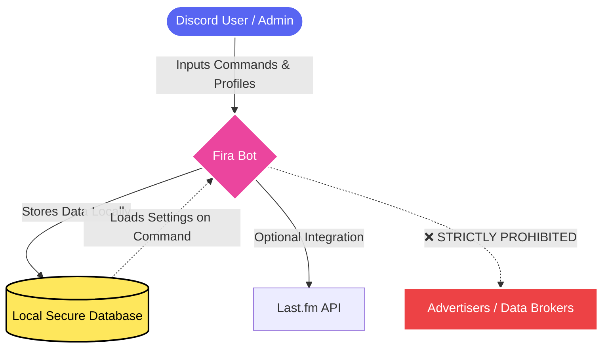
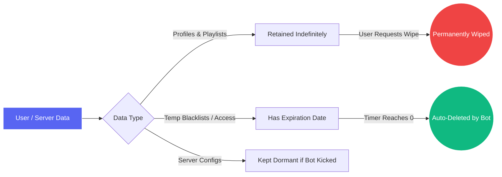
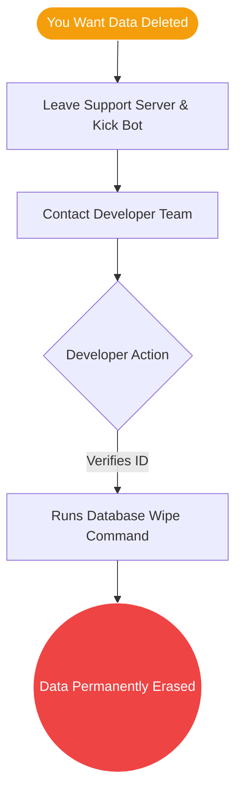

# 🛡️ Privacy Policy for Fira

Welcome to the **Fira** Privacy Policy. We value your privacy and believe in full transparency regarding how your data is handled. By inviting Fira to your Discord server or utilizing its features, you consent to the data practices described below.

> [!NOTE]  
> **Quick Summary:** Fira only collects data necessary for its features to work properly. **We do not sell, rent, or share your data with third parties.** 

---

## 🗄️ Data Flow & Storage (Visualized)

To help you understand exactly where your data goes, here is a visual representation of Fira's data lifecycle:

> [!IMPORTANT]  
> As shown above, your data **never** leaves the bot's ecosystem unless you are explicitly using an integration like Last.fm. 

---

## 📊 1. Data We Collect & Store

To provide you with the best music and bot experience, Fira uses a secure local database. Here is exactly what we store:

### 👤 User Information
| Type of Data | What it is | Why we need it |
| --- | --- | --- |
| **Discord IDs** | Your unique Discord identifier. | To link your profile, settings, and permissions to you. |
| **Social Profiles** | Badges, bio, friends list, and marriage status. | To display your custom bot profile using our commands. |
| **Settings** | Music platform preference (e.g., YouTube Music). | To tailor your music searching experience. |
| **Last.fm Data** | Username, avatar, display name, and play counts. | To fetch and display your listening stats via the Last.fm integration. |

### 🏘️ Server (Guild) Information
| Type of Data | What it is | Why we need it |
| --- | --- | --- |
| **Discord IDs** | The unique ID of the server. | To store configuration specifically for your community. |
| **Configurations** | Custom prefixes, voice roles, ignored channels. | To allow server admins to customize how the bot operates. |
| **Setup Data** | Channel IDs and Message IDs for 24/7 or Music Request panels. | To keep automation and music request features active and functioning. |

### 🎵 Music & Playlists
| Type of Data | What it is | Why we need it |
| --- | --- | --- |
| **Custom Playlists** | Playlist names, saved track URIs, durations, and titles. | To allow you to save and instantly load your favorite songs. |
| **Permissions** | User IDs of members you invite to edit your playlists. | To allow collaborative playlist management. |

### 🛑 Moderation & Security
| Type of Data | What it is | Why we need it |
| --- | --- | --- |
| **Blacklists** | User or Server IDs that are banned from using the bot. | To protect the bot from abuse. |
| **Access Control** | No-prefix access data and specific rank permissions. | To grant premium or administrative access to authorized users. |

---

## ⚙️ 2. How Your Data is Used

> [!TIP]  
> **Your data stays with Fira.** We strictly use your data to power the bot's functionality. 

- **Executing Commands:** Remembering your setup configurations so you don't have to input them every time.
- **Automation:** Assigning voice roles or automatically connecting to 24/7 voice channels based on your saved server settings.
- **Integrations:** Only communicating with verified third-party APIs (like Last.fm or Lavalink) directly related to commands you intentionally trigger.

---

## ⏳ 3. Data Retention Lifecycle

Data is kept in Fira's database as long as it remains relevant to the bot's operations. Here is how we treat different types of data over time:

- **Active Data:** Profiles, settings, and playlists are retained indefinitely while you use the bot.
- **Temporary Data:** Time-limited no-prefix access or blacklists are automatically invalidated upon expiration.
- **Orphaned Data:** If Fira is removed from a server, server-specific configurations remain dormant. 

---

## 🗑️ 4. Your Rights (Data Deletion Process)

You have full control over your digital footprint. If you wish to have your data erased, the process is straightforward:

1. **Server Data:** Server administrators can remove the bot, and manually clear channel configurations by deleting the associated channels.
2. **Personal Data Wipes:** If you want your user profile, Last.fm connections, and custom playlists entirely wiped from our systems, please contact the developer team to execute the wipe.

> [!WARNING]  
> Once a developer manually deletes your profile data upon request, it is **permanently lost** and cannot be recovered.

---

## 📬 5. Contact & Support

If you have any questions about this Privacy Policy, your stored data, or if you'd like to submit a data deletion request, please reach out to the bot developers through our support channels.

*Last Updated: May 2026*
