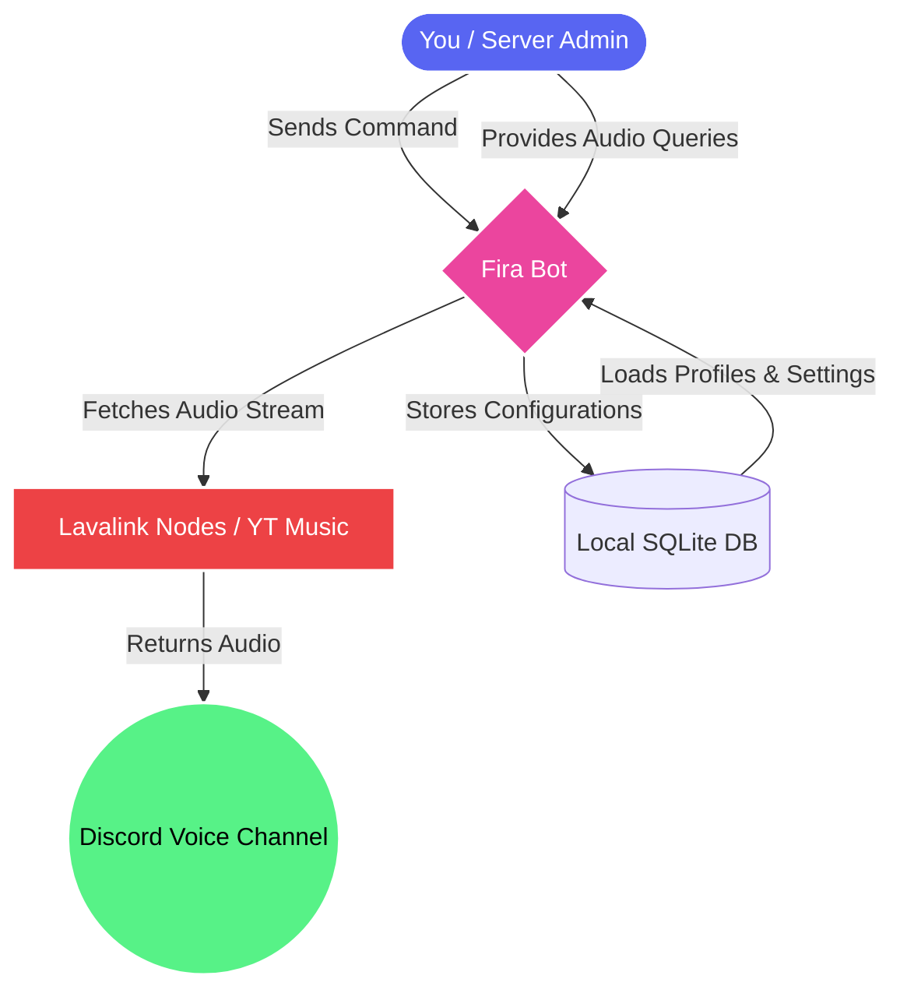
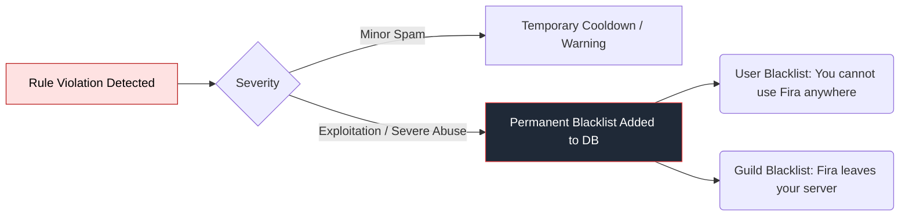

# 📜 Terms of Service for Fira Bot

Welcome to **Fira**! These Terms of Service ("Terms") govern your access to and use of the Fira Discord bot. 

> [!IMPORTANT]  
> **Agreement to Terms:** By inviting Fira to your server or interacting with its commands, you automatically agree to be bound by these Terms, as well as Discord’s official [Terms of Service](https://discord.com/terms) and [Community Guidelines](https://discord.com/guidelines).

---

## 🗺️ How Fira Operates (Overview)

To give you an idea of your responsibilities versus our responsibilities, here is a visual breakdown of how Fira interacts with you and external platforms:

> [!NOTE]  
> **Fira acts strictly as a middleman** between your queries and third-party platforms. We do not host, store, or distribute copyrighted media ourselves.

---

## ✅ Allowed vs. ❌ Prohibited Actions

To maintain a fast and reliable bot for all servers, we strictly enforce the following rules:

| Action Category | 🟢 What you CAN do | 🔴 What you CANNOT do |
| :--- | :--- | :--- |
| **Command Usage** | Use commands at a normal, human pace. | Use macros or self-bots to spam commands rapidly to cause lag. |
| **Music Playback** | Play music, podcasts, or safe audio in Voice Channels. | Play highly offensive, illegal, or ToS-breaking audio content. |
| **Bot Exploitation** | Report bugs or issues to the developers. | Attempt to hack, reverse-engineer, or crash the bot or its Lavalink nodes. |
| **Social Features** | Create fun profiles, bios, and custom playlists. | Use profiles/bios to harass, dox, or defame other users. |

---

## 🛑 Violations and Blacklisting

We take the stability of Fira very seriously. If our automated systems or developers catch you violating the rules above, the following enforcement flow occurs:

> [!WARNING]  
> Bypassing blacklists using alternative Discord accounts (alts) will result in a network-wide ban for all associated accounts.

---

## ⚖️ "As-Is" Service & Uptime Guarantees

Fira is provided as a free service to the Discord community.
- **No Guarantees:** The bot is provided on an **"AS IS"** and **"AS AVAILABLE"** basis. 
- **Uptime:** While we strive to maintain 24/7 uptime and stable music playback, we cannot guarantee zero downtime or complete immunity to bugs.
- **Feature Changes:** We reserve the right to modify, restrict, put behind a premium wall, or completely remove features without prior notice.

---

## 🔄 Updates to these Terms

We may periodically update these Terms of Service to reflect new features or policy shifts. 

> [!TIP]  
> **Stay Updated:** We recommend joining our Support Server to get notified whenever major changes are made to our Terms or Privacy Policy. Continued use of Fira constitutes your agreement to any updated Terms.

---

### 📬 Contact Us
If you have questions, need to appeal a blacklist, or wish to report abuse, please reach out to the bot developers directly via our support server.

*Last Modified: May 2026*
